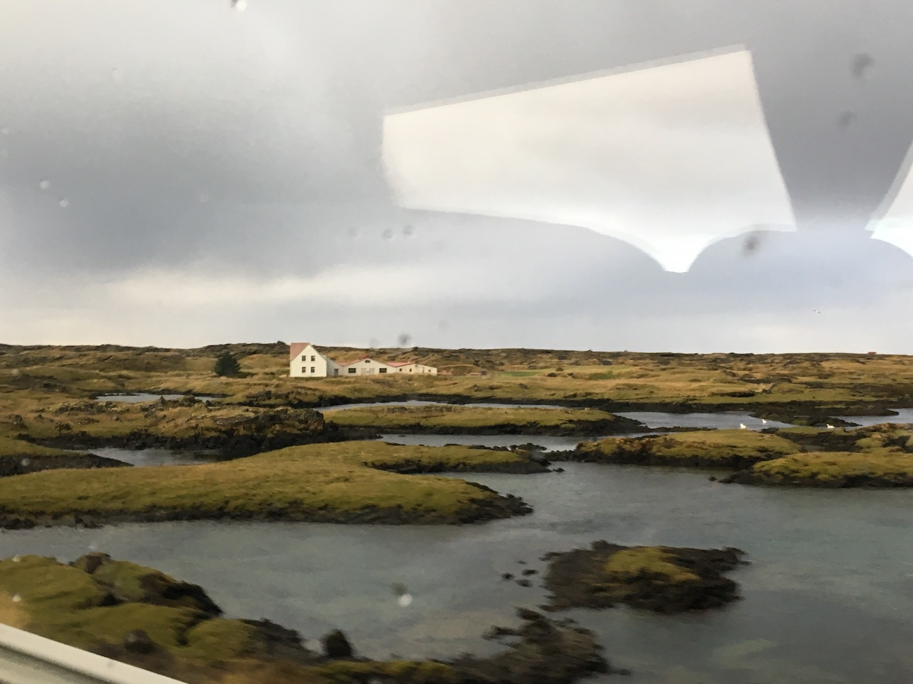
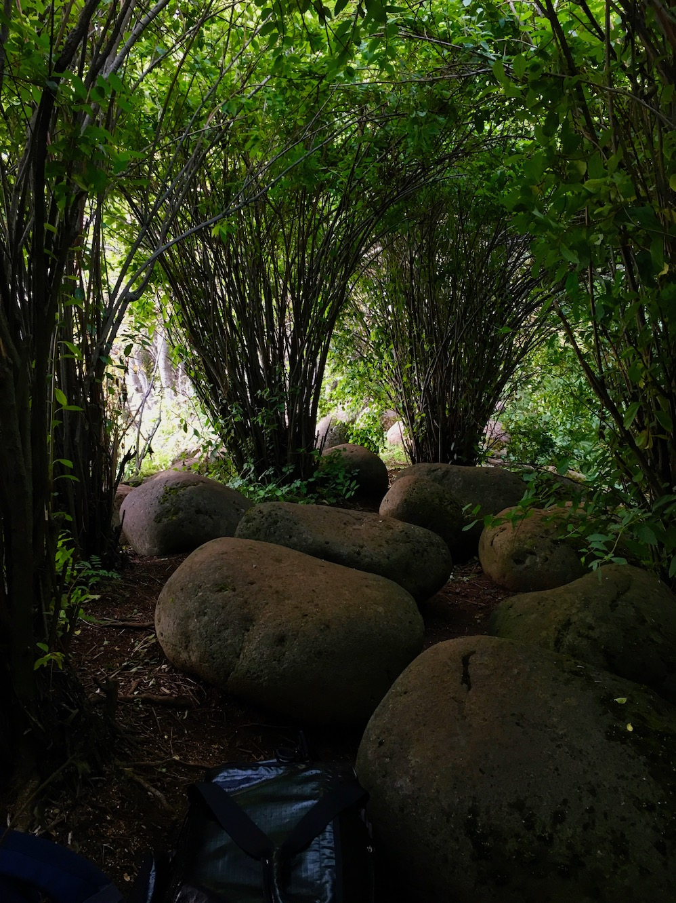

Another 12 hours at Keflavík. Layovers in Iceland are governed by a series of unchanging rituals. The scramble for an overpriced bus shared with Eastern European laborers. Fifty minutes of truly new landscapes along the highway—clapboard houses beside bogs, black rocks swelling and falling away into Listerine moss and impossibly thin sheets of water. Your phone focuses on none of it, capturing only partial reflections of the Australian in the seat beside you.

And finally, the bright promise of air-fried fish and chips at the harbor. I’ve never known Reykjavík unencumbered, and after eating, I found myself once again dragging two duffel bags south through the city, searching for somewhere to sleep. It began to rain as I reached Hljómskálagarður, a formal park past Lake Tjörnin scattered with that distinctly Northern European variety of playground equipment. The wind and spray off the lake was unbearable, so I pushed into a cluster of trees. A mossy path narrowed with each step, but my clothes were soaking through, so I followed eagerly and was soon crawling through low, dense bushes. 

For nearly a minute, there was nothing but the expanse of soft leaves and the sound of my bags on the ground. Then all at once, the foliage parted to reveal a surprisingly large interior space (64°08'26.6"N, 21°56'20.7"W) formed by tight clusters of coppiced branches. They billowed out and met above like jagged, miniature domes. 

Inside, it was completely silent and dry. I walked through the network of “rooms” at a crouch, following the bush 100 feet along the park’s edge and then back to my gear. I laid my camping pad between the cartoon boulders and slept for a pristine six hours, waking completely dry in time to catch my next flight.