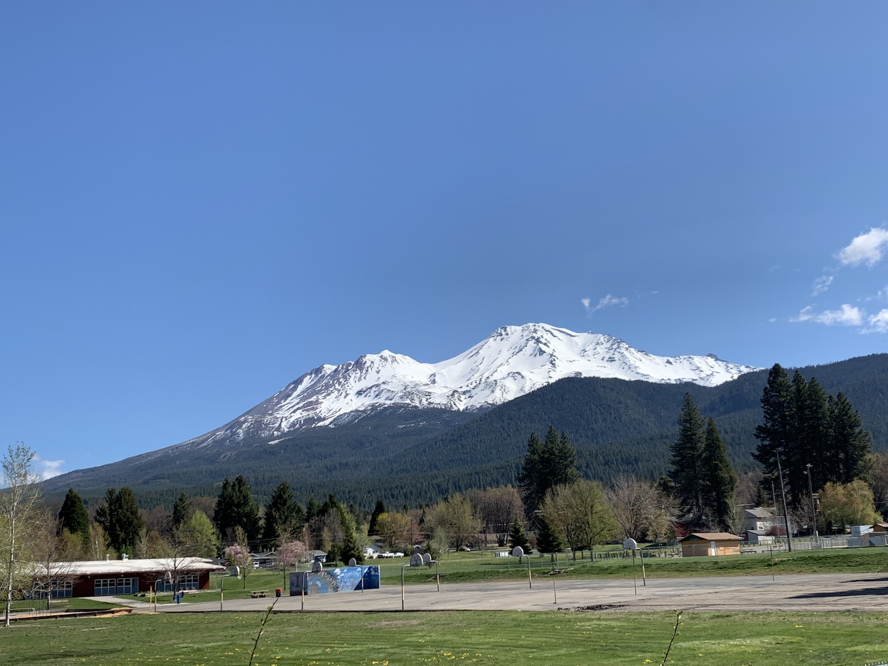
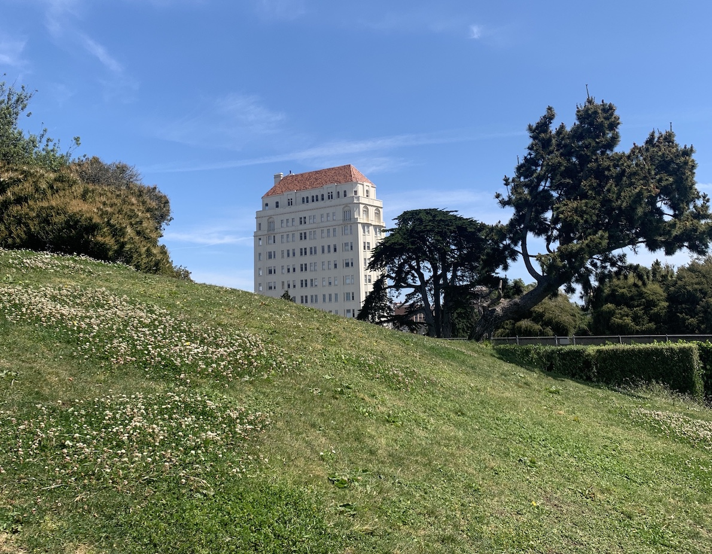

I rented a car and set out north for Oregon, where you could still get land for $1000 an acre and zoning laws didn’t exist. There was a small plot listed north of Bly, off-grid but lush in the spring. A group of us had convened, and I’d been nominated to check it out.

I pulled off the 101 at Chualar and took the frontage road through the Salinas foothills, stopping to circle up into one of those developments in the canyons where the neon lawns cut into dead-gold grass right at the property line and everyone looks out suspiciously from cool, well-stocked garages.

By early evening, I was in San Francisco. Ian had recently moved into a NoPa apartment with Alix, an engineer who worked on Macbook speakers. Alix gave off the sense of east coast power but was the only person I’d met who could match Ian’s enthusiasm for the world. We biked to Ocean Beach, swam, and decided abruptly  to leave for Oregon that night while dangling from the flimsy metal facade of the de Young.

Ian and Alix made out ferociously in the back seat as The Beths played and I drove through the night. In the darkness, the final grade dropping into Shasta was terrifying, and I called a friend named Tory to see if we could sleep in his cabin. After a whispered conversation on the porch, we shuffled inside, and I passed a fitful night on a bare mattress that smelled like thrift stores.

The morning was crisp: a walk through Shasta’s wetland meadow, slimy sandwiches and pie and garlic bread in Klamath Falls, and then a series of stops to swim beside the highway. Before Bly, we cut north and the roads began to narrow—first to two lanes weaving through shrubby pines and then to nothing at all, a rocky surveyor’s path that struck out into the grid of perfectly rectangular BLM properties. There was a buzz in the car: somewhere out there was our land.

The rental was a 2019 Jetta—poorly appointed for our new purposes, but the phone insisted that we were less than two miles away. Within minutes everyone was out walking beside the car, moving rocks and compacting sand to help our bald tires get traction. Manzanita branches tore long, delicate strips of paint from the car’s sides. Tory had decided to join us, and he took the first two riverbeds with a steady hand, telling stories through the open windows about his time off-roading a Prius in British Columbia.  

We couldn’t find space to turn around, and each gulch was harder than the last. The front tires were on their way up before the back tires bottomed out, leaving enough clearance under the car for someone to crawl through. Finally, we pulled onto a long flat stretch and checked the directions: less than half a mile. Spirits were up, and we flew over rocks the size of watermelons toward a cluster of trees on the horizon and the land that would surely lie beyond—cheap land, land to build on, our land!

An abandoned grey sedan was the first sign of trouble. With a child seat visible in the back, it lent a sense of finality to the impassable riverbed that we found moments later at the tree line, carpeted with boulders that looked to have been washed down in a recent flash flood. We decided to take a break and think of a plan, so I walked down amongst the boulders, dappled with that serene light that falls through Oaks in late spring.

Just as I found a quiet place to pee, there was a sound from the opposite bank. A large ATV appeared through the tree line and came to a stop right above me. Spilling out the seat was one of the most enormous men I had ever seen. He had a black Roswell tank top (“I believe.”), long clumps of white hair, and a pitbull on the seat next to him.

I zipped up my pants, put on the most neutral accent I could manage, and shouted up the hill that we seemed to be stuck. The man looked through me, focusing on nothing. He spoke without any sense of responding—as if delivering the opening line of a play: “As I was saying, you’re here to see the land?”

He hadn’t been saying anything, of course—we had never met, nor had I interrupted him. Nobody knew we were coming. He kept going: “I’m a disabled veteran, so I’ll let you move these rocks for me so I can cross.” 

Without a word, I leapt to action and began the comical process of shoving the smallest boulders aside while he watched and smiled distantly from twenty feet above. Ian, Alix, and Tory gathered behind me and looked on silently. A path across the riverbed slowly emerged, and he kicked the ATV back into life, rolling down toward us. The dog leapt down and began to run in circles. 

As the man pulled closer, I noticed a large, silver pistol dangling from a holster loosely tied around his neck. During the descent, it had swung erratically and finally come to rest on the immense shelf of the man’s gut, where it now sat leveled at us—the barrel poking out through the bottom of the leather pouch.

“Where’s the big guy? He wanted to see my property. I don’t show it to just anyone. Better than that rocky shit behind me.” Before we could respond, he was halfway up the opposite bank toward our rental, leaving us determine at a whisper that none of us were “the big guy”—that this man was truly an unknown feature of Oregon’s landscape.

Dad’s warnings about Oregon’s hatred of California came to mind, but the rental luckily had Washington plates. I jogged after him up the slope and started explaining that we were from Seattle, down for the weekend to look at properties. His son was stationed on a base in Washington, so he took this as a sign of affiliation and began to talk freely, explaining in a drawl that his land ran from the brown fence to the grey fence, 1000’ deep; that he lived on deer meat stored in a camping cooler, which he refilled every two months by lying very still on the border with his pistol and taking the first buck he saw; that his other dog had been eaten by a mountain lion, which he hunted down for weeks.

“This one looks like it can take of itself,” I offered.

“Oh, Spike’s a sack of shit: normal cat swiped his back leg and it took $500 of stitches. Now what are you standing there for? Follow me to the land.”

We managed to turn the Jetta around and followed slowly, repeating the process of going up and down each gulch as the man roared ahead, heedless of the slopes. Cheerful, fragmentary conversation shouted through the windows was interspersed with hushed debate in the rental. It was evident that he had no connection to the original plot and should have had no reason to know we were there to buy land at all. Alix said he wanted to kill us, but Tory only seemed amused. I made a half-hearted case for seeing his land, but Ian raised the image of our skins stretched out to dry in front of some decrepit trailer.

 
Eventually we reached the main road. The man beckoned us to pull up beside him and turned in his chair. “Now, y’all are following me to see my property right?” To the right of the path, there was a narrow driveway that we hadn’t noticed on the way in, sloping down sharply and turning out of view into a dense thicket.

“Sure are!” I called. His torso remained turned as he slowly nosed down the hill. I made as if to follow him, inching forward with a broad smile. He held eye contact the whole time, even as he slipped around the corner and was lost in the trees.

First Ian then Alix then Tory started to scream—“run, go, away”—and I complied, dropping into reverse and gunning it backwards up the path and out onto the highway, where we spun around and sped back past Bly, across the border, and toward the Bay, imagining the whole time that the man would burst through the tree line before us from some unknown backwoods path, handling us head-on with the pistol as we tried desperately to swerve.

I spent the next day in the sun on the southern slope of Alta Plaza Park, where I spoke to Ortiz on the phone for hours.