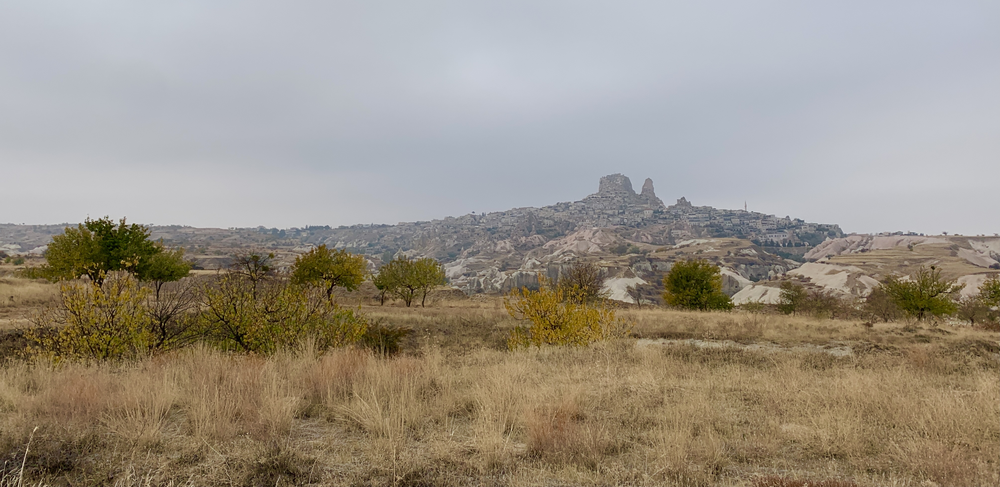
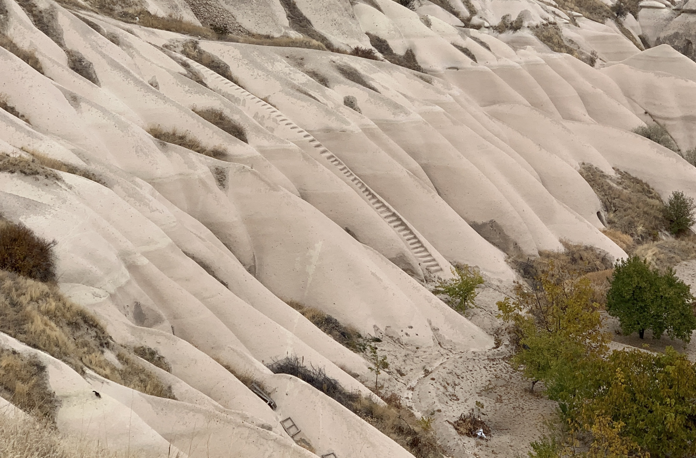
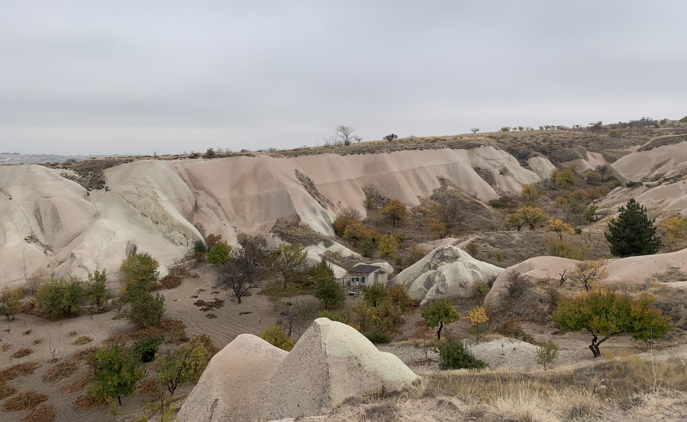
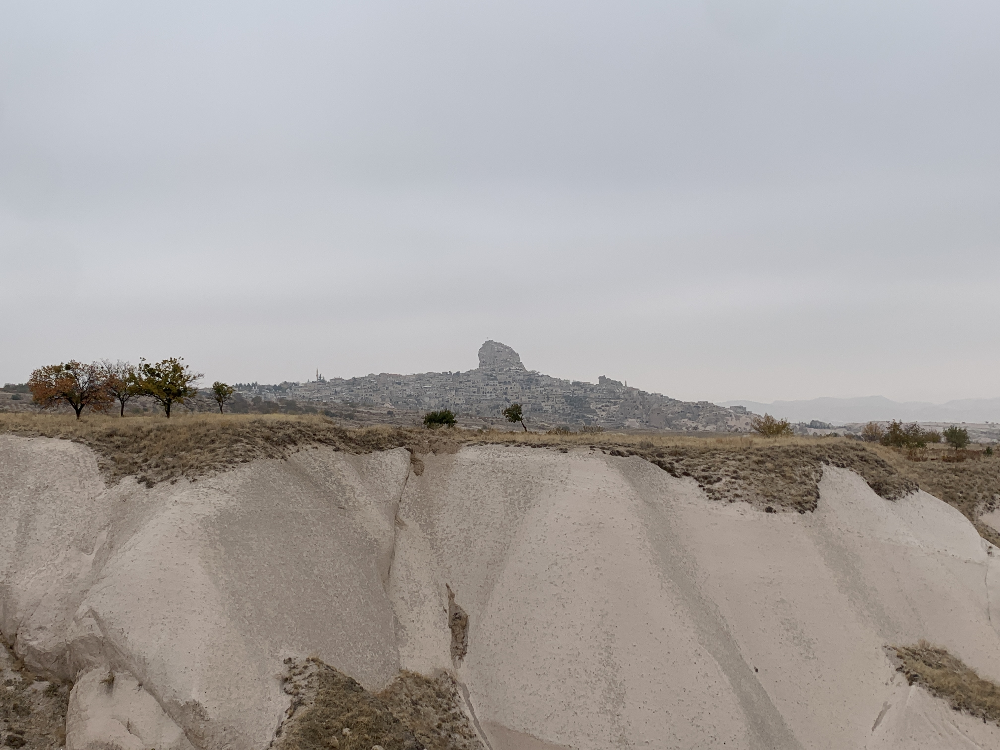
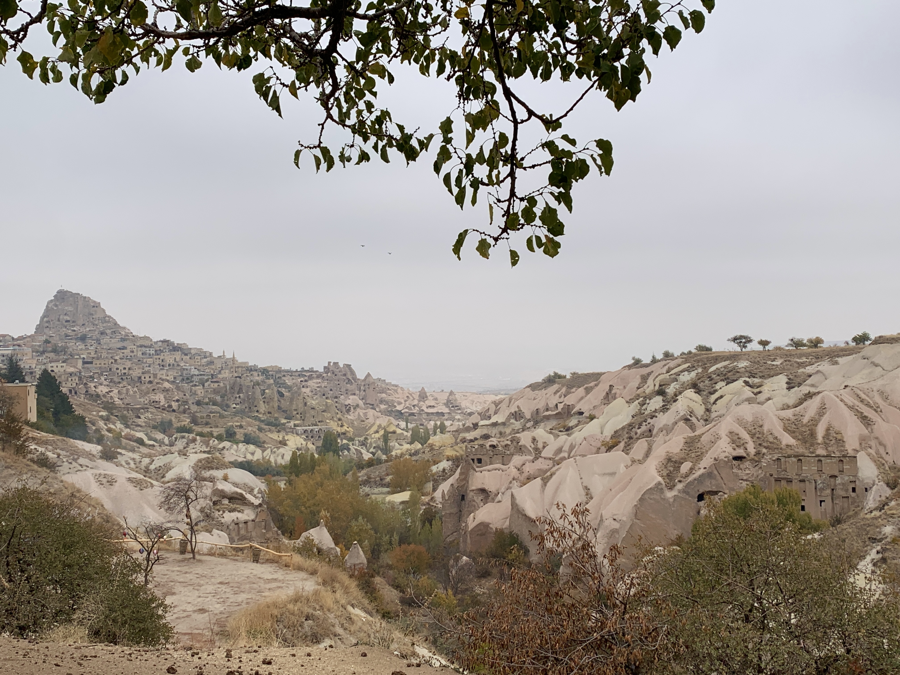
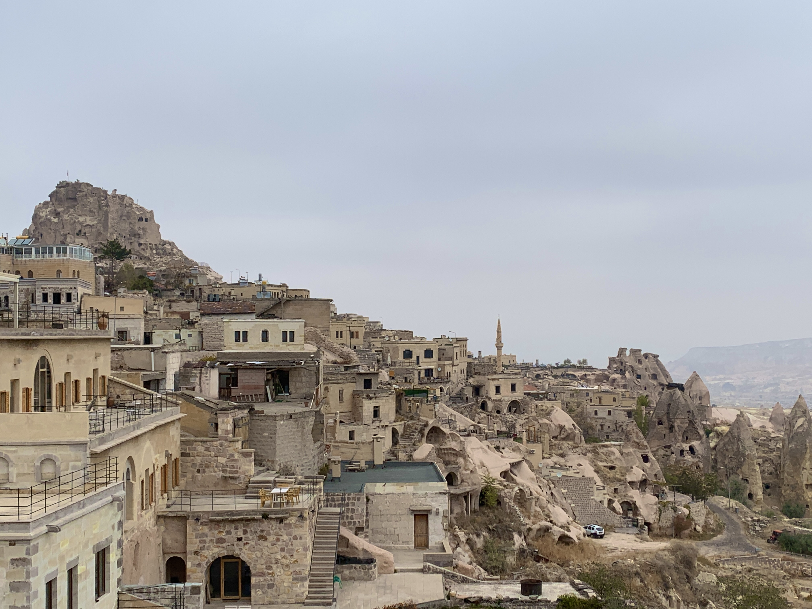

A sloping four miles to Uçhisar from Göreme, passing small orchards set down in the canyons and steps carved into the stone.

In town, packs of dogs roamed windy streets and relentlessly pursued our lunch: microwaved Manti from a local cafe. The man guarding the castle toilets extended a bucket taped to a stick to collect our 2 Lira. Uçhisar's movements on the horizon appeared in my dreams for weeks afterward, but the sudden loss of tourism gave the town a sense of despair that we hadn't encountered elsewhere in Turkey.

