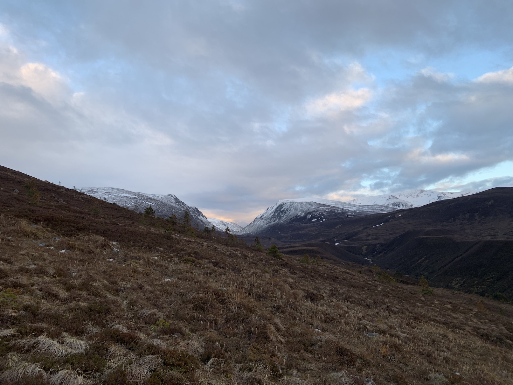
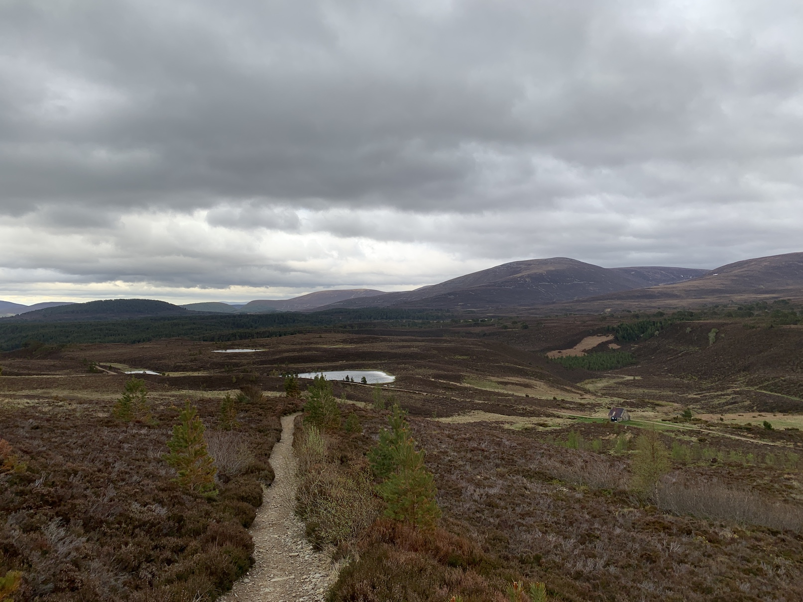

The dawn train to Aviemore, then out past Loch an Eilein to the boggy trails northwest of Ben Macdui and the Caingorm plateau.

After a night on the moors, we walked through the Ryvoan Pass in light rain, the hills thick with fog—everything heavy and silent and serene. We took shelter in a bothy at the edge of Abernethy Forest and listened as the trails were washed away, driving us back to the Pine Marten Bar and an early return to Marchmont the following morning. 

