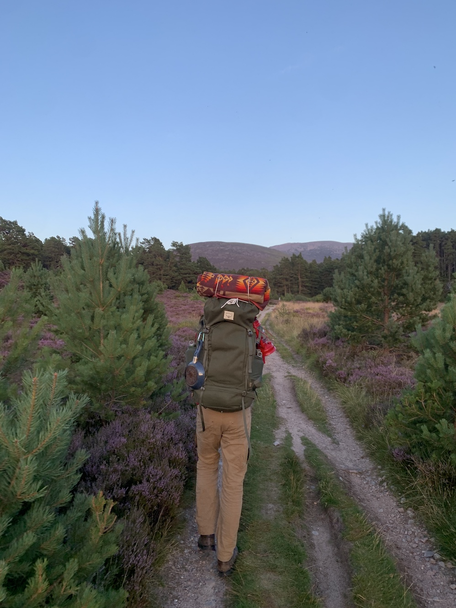

After a frantic stop in Morningside, we arrived in Aviemore after 6pm, cutting out into the Cairngorms with less than two hours of light. 

We pitched up in Allt Druidh and soon had our first taste of the midges. At dawn, a low fog clung to the heather and ferns: the younger pines all veiled in webs and frost that caught the first light. 

By mid-morning we were past the dogleg and out on the plateau. Braeriach’s peak was broader than I expected, rolling gently along the cirque’s ridge and then down toward the Pools of Dee. To our left, immense blocky shadows slid around on the floor of the corrie.

From the Pools of Dee, the ridgeline starts to feel like an obstacle course, with a series of saddles and boulder fields connecting the three remaining munros and each of the minor peaks between. Even in high summer, the plateau is stark. As my phone died, a herd of reindeer appeared on the shoulder of Sgòr an Lochan Uaine and then flowed around us, meandering down toward Glen Feshie.

After finishing on Bod an Deamhain, we cut down to Corrour, where a funny little Czech was sunning himself outside the bothy. While methodically ruining each bottle of his delicious mountain water with iodine, he warned us about ‘ze midgies’—a crisis we failed to appreciate until the next morning, when we woke to a low humming and skies black with bugs. 

They hung on the tent like a liquid: their strategy less to sting than to suffocate, pouring down our throats and into our ears. In a misguided attempt to shield my face, I emerged wrapped in bandanas with a pair of sunglasses on, but within seconds they had found their way behind the lenses, bouncing around back there like pinballs and leaving a halo of red bites around each eye. I couldn’t even roll up the tent; we just ran down Lairigh Ghu, hobbled by the climb and dragging everything behind us.

The rest was fragmentary: spam and eggs on a boulder field in the Chalamaine Gap, an endless trudge through the growing scar of logging fields around Morlich, and then that old favorite, the Pine Marten Bar.

When Wheaton and I are together, there are an almost unsustainable number of conversations with strangers. One stands out—a Lithuanian cabbie who drove us back to Aviemore. When asked how he’d ended up in the Highlands, he first said “People leave you alone up here.” Then he got a distant look, reconsidered, and explained that he was running from a life he had built off the coast of Cornwall. 

He was young: a recent arrival to London but already fed up with it. In the kitchens where he worked, a line cook mentioned an opening in a hotel on the Isles of Scilly. They offered him a job over the phone, but all they would say was to turn up at Newquay Harbour that night with a rain jacket and a torch.

He started on St. Martin’s the next day, quickly learning how the islands fit together and how to navigate the dense little world they contained. Tresco was his favorite. He had fond memories of his accommodation on the beach there, where he could swim in the sea while running his evening bath. When another cook retired, our cabbie claimed the small boat he left behind, teaching himself to sail after shifts in the forgiving shallows of the archipelago. He’d take the boat as far as he could, often dragged more by the currents than the wind, and then rely on a dinky outboard motor to return home. He never mentioned what it was that he left there, but it seemed better not to ask.

Kate Bush played very quietly on the radio. We were sharing the cab with a young boy and his mother who had sat next to us in the Pine Marten. After staring intently at his hands for most of the ride, the boy said, “You know, I have ten fingers and six of my fingers have chocolate on them. That’s not bad!” Wheaton and I agreed: that wasn’t bad at all. A diffuse yellow light fell over Scotland all the way home, making even the fields of dead grass look decadent and natural.
