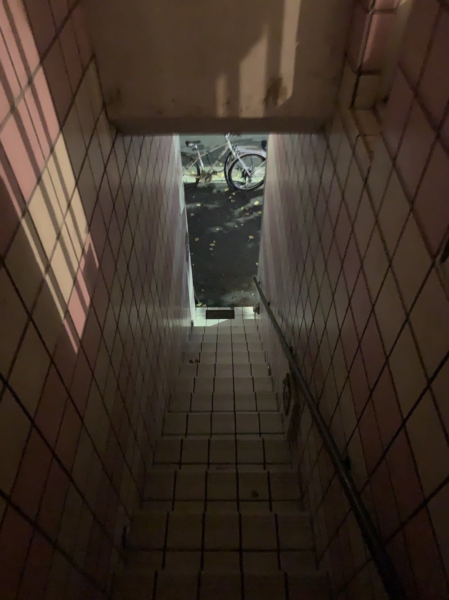
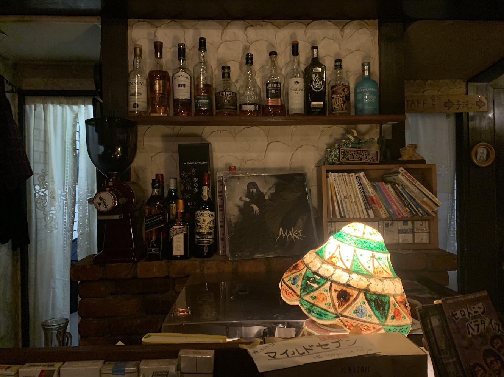
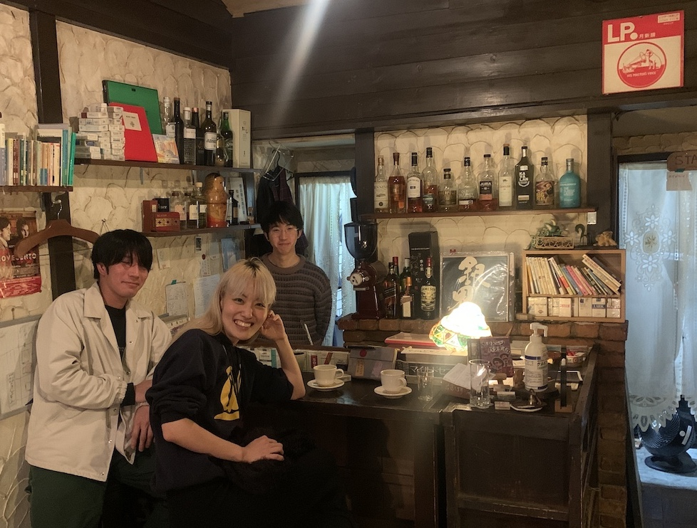

---
title: Midnight Cafe ShinShinShin
---

I reached Kyoto in rough shape.

A desperate drive to the northern tip of Hokkaido had left me depleted and with a persistant numbness in a few fingers. I'd driven twelve hours to stare at some Russian islands on the horizon and then waited out a blizzard in a sulfurous pond, submerged to my nose beside a toad-like man who sat up serenely, half-covered by snow. When I stumbled into her jazz bar in Sapporo a few days later, Ryo Fukui's widow served me a dish of warm cod semen and told me to take better care of myself.

By contrast, Kyoto was like a commercial for the good life: warm and bright, split by the hale median of the Kamogawa into a grid of riverside parks and delicate wood houses. Long thin skerries dotted the river, covered with tall grass and patrolled by egrets and herons. 

Upstream, at the dramatic confluence of the Kamo and Takano, rows of broad stepping stones carved into turtles led out to a triangular delta, where the banks sloped sharply up to a tree-lined park. Students lounged everywhere, playing music and baseball, making short films, laughing as they ate convenience store desserts. I recovered quickly.

I'd come to Kyoto to find Yoshida, an old student dormitory that had loomed in my imagination since college, when a show set there had seemed the key metaphor to my remaining months as a student. Treehaven, the faded Victorian hotel where we'd lived in Berkeley, seemed in many ways Yoshida's Western twin: the same long dark-panelled hallways, the same aura of lively neglect.

When I arrived in Japan, I hadn't even known that Yoshida was real until a man in a Tokyo bar scrawled an address onto the back of his business card, shoved it into my wallet, and told me not to be too disappointed.

Then he gave me the story. Since being built in 1913, Yoshida had been locked in a conflict with the university over its unusual self-governing and non-affiliated status: adjectives that seemed entirely out of place in my brief experience of Japan. After decades of neglected maintenance, it was now collapsing, which the university had used as a pretext to formally evict all the students four years earlier. Only a few remained.

As I stepped onto the long entry path, I got an immediate sense that the battle was going poorly. I had arrived in the middle of the student activity fair to a campus packed with booths and talent shows. Just one block over, Yoshida sulked in silence: the wood walls beautiful but visibly weathered, the roof coming down in places.

I'd watched an old documentary on the conflict in Tokyo and knew the faces of the key players, but I was surprised to find that many were still there. I even saw the ringleader pacing between the buildings with a mane of black curls and a little entourage of Beatniks. He looked embattled, Churchill stalking between the war rooms, and the place had an overriding sense of being years into a conflict that it had already lost.

By the entrance, piles of papers spilled off a folding table. As I loitered by the door trying to decipher a sign, a resident very methodically gathered each of the pamphlets into a neat little pile and handed it to me, explaining in considerate Japanese that he didn't have time to show me around just now but that these would help me find my way.

I took my reading material and walked inside. Yoshida's floorplan described a vast U, with two long parallel wings and an overgrown courtyard in the center. Distinctions between interior and exterior were limited, with doors that had clearly not been closed in decades leading out to thickets of bamboo or small untended vegetable gardens.

A few students sprawled on the floor chatting, sitting amidst the collected debris of a century of the collegiate lifestyle. The corridors were long and dark, with paper trinkets dangling so low that you had to duck around them.

Back down one of the corridors, some French girls cooked dinner in a blast zone of grease, the surfaces all plated with blackened tin foil. I asked if they lived there but only one bothered to look up, offering silence and a rusty little grimace. The pamphlet explained that Yoshida took in the occasional international students, and I wondered how they'd found this place and what they made of it.

Upstairs it felt like I'd fall through the floorboards with each step. Yoshida used to be so packed that it was two to a room, but whole corridors were in darkness now. I put on my headlamp and ventured into one of the empty rooms, which had a little balcony looking over the courtyard.

I read one of the pamphlets while I walked around. I was drawn to it because it was big and floppy like a newspaper, stapled at the top and illustrated with a washed out photo of Yoshida's entrance. Each page was a different scene from the ongoing trial: statements from academics, diagrams from seismic experts, long passages of legal debate.

I stopped on a speech given by a local business owner. Even in translation, it was a good speech: nostalgic and kind, with a clear sense of loyalty to Kyoto instead of the specific zeal for Yoshida that animated all the others. I pictured an older man reading it to a room of people that had to lean in to hear him - someone who had spent their life in the city and watched it change. He spoke about the magnetism and atmosphere of Yoshida, "a place where time accumulates", and the dizzying pace of the economy that it resisted, the forces trying to turn Kyoto into just another city - "an empty, boring, and suffocating world of efficiency and profit, devoid of thought and aesthetics." When the speaker pointed out the university's inconsistencies, he did so with an empathy that the other speeches had lacked, like he had expected better of them; it gave his criticism a moral authority. At the end, he even turned to lightly chastize the students, warning that getting entrenched in the conflict and turning inward wouldn't do them any favors. If they wanted their own space, they needed to show pride in it and share it with others. I found the whole thing moving and more than a bit sorrowful. It reminded me of the tone that Ishiguro often strikes - sentimental, mature, but a bit playful with the resulting melancholy.

At the top of the page, they listed the man's name, Go Matsumura, and the name of his business, Midnight Cafe ShinShinShin. I liked the name because of how it danced around and because I could actually read it. I stopped the next resident coming down the corridor and managed to ask him if ShinShinShin was nearby. He said it was 15 minutes away and that it usually opened late.  

It was just shy of 9 when I found the place: an upstairs unit, perched above a little row of shops at the outer edge of a student neighborhood. Across the street, a forested hill loomed under a sliver of moon. The sidewalks were empty but a few of the shops had their lights on.

I climbed a narrow staircase of pink and white tiles and knocked hesitantly on the door. A few seconds later, a young man's narrow face slid out horizontally. He wore round wire frame glasses that made him look a bit like a cartoon character, with a few strands of hair standing straight up from a shaggy black bowl cut. He asked in a delicate voice if I would wait just a minute and then slipped back inside. When he reappeared, he introduced himself as Go and showed me through the door.

ShinShinShin was a jazz kissa, a category that had been new to me a few weeks earlier but was now dear and familiar. Kissas are like dive bars, but smaller and without the aura of expectant violence. They play loud vinyl while people smoke and speak little or not at all, except when something in the room shifts and suddenly everyone is roaring together at the bar. ShinShinShin took this outline and gave it a literary bent. There were novels piled everywhere, a little loft for storage and a narrow alcove where one person could sit at a low table and read. The moonlit hill was framed in a bank of windows that opened over the street, making the space feel more like a treehouse than a business.

Bottles of scotch were arranged lovingly over the bar, which managed to fit a turntable, hundreds of foreign cigarette boxes arrayed like a curtain wall, and neatly tended piles of local memorobilia onto a work surface maybe three foot by two. Everything fell under the low, dazzling light of a stained glass lamp, slightly angled to cast the greatest illumination on Go's hands as he worked.

On the only couch, two older men spoke gracefully. One wore a cowboy hat and a luxuriously sequinned shirt. For them, evidently, the opening time had been earlier.

As I sat down at the bar, I could immediately tell that it was the young man's domain: a place he had built and loved, a bar that he stood behind deep into each night and again in his dreams each following morning. Suddenly I realized that this was the same Go whose speech I had read at Yoshida - only 40 years younger than I had imagined. 

Go had a habit of whispering the second halves of his sentences, which made me lean out over the bar and whisper my own. In this way, between orders and with considerable strain on both of our languages, I heard his story.

Go had never lived in Yoshida himself, but he served coffee at their events, followed their fledgling garage bands. Raised in Osaka, he studied Spinoza at Kyoto and then opened ShinShinShin after graduating. There was a natural affinity between the two places: some shared commitment that seemed to relate Yoshida to ShinShinShin, but I couldn't quite work out the relationship. There was a political flavor to it, but none of it mapped onto the sort of culture you find on a Western college campus. There was too much maturity at play - the easy confidence of people building their own dreams, people able to both run a pleasant business and talk compellingly about literature.

As we spoke, a close friend of Go's joined us at the bar with a pile of new paperbacks. Soon he was talking about his job at a nearby hotel and explaining how he'd built the bar from scrap wood himself.

Despite the hour, everyone ordered coffee, which Go made with a flannel drip and his full attention: setting up his little apparatus, warming the cup, taking the temperature of the water, and then pouring in fluid wristy circles. Whenever you said anything complimentary about ShinShinShin, which I did free and often, Go got a sweet little smile and looked down at his  pouring. He reminded me of a child that knew a secret. I enjoyed the contrast between his young mannerisms and old presence, that mature voice that had come through in the speech. He manned the counter with the same authority, something that I hadn't seen in many Japanese cafes, where the staff bowed stiffly and seemed embarassed by delays. Go got to people when he had time, and they waited happily for their drinks.

As if by explanation, the friend revealed Go's tenure as president of a famous high school's student finance committee, joking that he carried that shrewdness into each decision he made at ShinShinShin: that behind the quiet mop of hair were devilish machinations of cost efficiency.

At some point the old cowboys got up to leave, prompting Go and his friend to fly from their seats and begin bowing frantically, folding up nose to knee like pocket knives. The older men laughed and nodded back before slipping out into the night, silver spurs clattering down the tile stairway as the boys leaned out over the bar to listen after them, eyes closed.

Go's friend turned and whispered: "That was Japan's best lyricist. This place is named after his song."

Go smiled. "I've been playing it tonight for them."

A few hours later Go's girlfriend Yuzu showed up: tall and dyed blonde in a Berkeley sweater, energetic and confident in conversation. She was working on a novel and had a habit of interspering long fluid thoughts in English with little bursts of Japanese adjectives. They were easy words, the sort of language that made a learner feel at home, but I couldn't tell if they were for my benefit or a natural mixing, some flavor that her English would always retain. We all talked deep into the night about Ishiguro and Mishima, about why public life could feel so alienating in Japan, about what made places like Kyoto and Berkeley feel old and powerful. I wondered if Go had summoned her covertly when he realized that we had memories in common. 

Yuzu asked me if I believed in ghosts, and we all laughed at how obvious the answer was. 

Who wouldn't have that night? There was such a ghostly symmetry to it all: finding a place that you've dreamed about for years and being handed a flyer there that leads to new friends with their own memories of your college town. Or opening a midnight cafe named after your favorite singer who then shows up and becomes a regular. If you believe that these connections are real and purposeful - that the contours of your life are traced rather than improvised - then things like this happen all the time. It would be stranger to imagine that they wouldn't.

I can't say how many cups of coffee I watched Go pour through his little square of flannel in my week in Kyoto. I made myself a regular, always taking the same seat at the bar and learning about the small group who came in every night. There was a single mother restoring a traditional house west of the river, a Chinese lawyer who'd settled in Kyoto 17 years back after coming for law school, a local English teacher who graded essays late into the night. They all carried novels in their back pockets and traded jabs about their writing. I attended their open mic one afternoon, where the Kyoto chapter of the Dead Poets Society gathered to read bits of verse. Go puttered around in the kitchen, laughing at how intently Yuzu translated the fierce discussions of language.

Spending too long on shore leave can trigger delusions. The world starts to feel emptier. There are fewer interesting people walking around than you would hope: even fewer eager to have conversations with strangers. You start to suspect that a meaningful chunk of humanity has strapped itself into the digital content vats and exited the social sphere entirely. 

In any city on earth, the traveler always has at their disposal that last port of call: the slick expat coffee shop, where English conversation (on varied topics like New York or even Brooklyn) is available daily at the perverse opening hour of 11am. Don't be fooled; these places are a mirage, dazzling but completely dry.

After a few years of traveling, I finally found something that I'd been looking for at ShinShinShin. It was a place that I'd been promised would play a much larger role in my life: a tavern at the edge of things, an outpost where a certain type of person gathers to discuss the cryptic fantasies that quicken their world. ShinShinShin proved not only the existence but the potential of this sort of place: that if you build one correctly, the right people will find it.

I'd long claimed that no American abroad would ever be left alone on Thanksgiving, but come Thursday, Kyoto was starting to look like the exception. I'd had a near miss with two guys from Georgia, willing but Tokyo-bound and unsentimental about the holiday. By dusk I was looking pleadingly at every American accent I passed on the street. After a few conversations sunk in the river ("We're a long ways out here, aren't we?"), I ate alone in Kyoto's ShakeShack while the Fleet Foxes played on repeat. Later, while sulking on the banks of the Kamogawa, I realized that ShinShinShin was the closest place I had to a home this far from California and walked back out there for another night of quiet revelry.

By the time I headed back to my hostel, all the buses had stopped running. I walked along the Kamogawa for an hour or so, watching the students stumbling home across the stepping stones. Eventually I got tired and found a little bush that was open to the stars, laid down, and slept for a few hours until just before dawn. When I woke, the river was full of a pearly red light that was peaking over the mountains - and it was time to leave Kyoto.